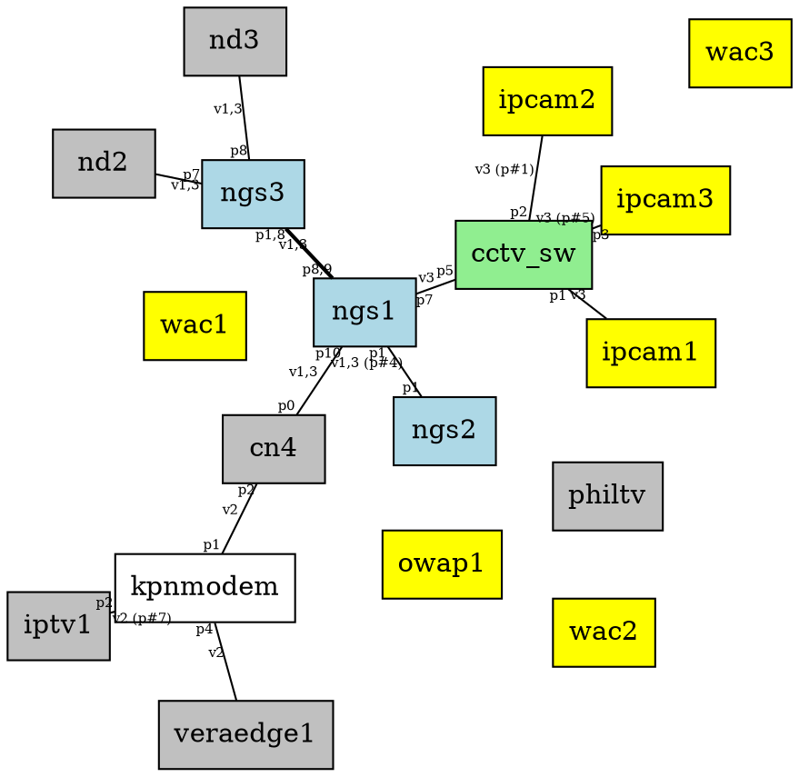

```graphviz-dot

  graph NET {
    layout=neato

    edge [weight=2.0 fontsize=7]
    node [style=filled shape=box]

    node [fillcolor=white] kpnmodem
    node [fillcolor=lightblue] ngs1 ngs2 ngs3
    node [fillcolor=lightgreen] cctv_sw
    node [fillcolor=silver] cn4 iptv1 veraedge1 nd2 nd3 philtv
    node [fillcolor=yellow] wac1 wac2 wac3 owap1

    kpnmodem -- cn4 [label="v2" taillabel="p1" headlabel="p2"]
    kpnmodem -- iptv1 [label="v2 (p#7)" taillabel="p2"]
    kpnmodem -- veraedge1 [label="v2" taillabel="p4"]

    ngs1 -- cn4 [label="v1,3" taillabel="p10" headlabel="p0"]
    ngs1 -- ngs2 [label="v1,3 (p#4)" taillabel="p1" headlabel="p1"]
    ngs1 -- ngs3 [label="v1,3" taillabel="p8,9" headlabel="p1,8" penwidth=2.0]
    ngs1 -- cctv_sw [label="v3" taillabel="p7" headlabel="p5"]

    ngs3 -- nd2 [label="v1,3" taillabel="p7"]
    ngs3 -- nd3 [label="v1,3" taillabel="p8"]

    cctv_sw -- ipcam1 [label="v3" taillabel="p1"]
    cctv_sw -- ipcam2 [label="v3 (p#1)" taillabel="p2"]
    cctv_sw -- ipcam3 [label="v3 (p#5)" taillabel="p3"]


  }
```

